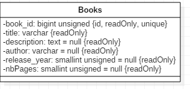

# AMT2017_Project1
## Group List :
- Emmanuel Schmid
- Anastasia Zharkova

# Project description and implementation choises

The purpose of this project is to deploy a web application using Java EE specifications.  We decided to deploy the application on Wildflay server. Our application allows to have information ( author, release day, number of pages) about all books which are in the store.   A book has an unique ID (auto incremental).  Our application will have an api REST in order to execute CRUD commands.  We can update a book (modify an ahtour or number of pages for exemple), delete a book, create a book (id is added automatically). All system will be deploy inside a docked contener. 

TODO List  ( improvements ) :
If at the end of doing basic things, we have time to improve some aspects of our applications it will be :
1) Make a sort of our database
2) Timestamp for during of a session
3) No need to go one more time on the /generateBooks after login

# Quick start

We assume that you have installed docker and docker-compose on your machine. Then, you have to go to directory containing *topology-amt* file and start docker-compose by typing:

`cd topology-amt`
`docker-compose up --build`

The first time you do that, it will take a some time because docker must fetch the source images from Docker Hub.
Then, in order to be sure, we can use `docker-compose ps` to check that ours containers are up usint the right ports. 

Then , you have to check that your server is up as well. You can do it via neatbeans --> services --> servers --> Wildfly ( in our case) right click --> start. 

When the process is done, you should be able to access the app server at the following URLs:

JBoss Wildfly -> `http://192.168.99.100:6060` (root/adminpw)

## Database
Database containes two tables: users and books:

  
  

## Architecture

  

## Generate books
Go tho the `http://localhost:9090/MVC-1.0-SNAPSHOT/` generateBooks links and choose a number to books to be generated. You must be logged in in order to access this page. Once user is logged in (admin/admin), he has to go to the generateBooks page and put the number of books to be generated. If the number is too big, pages returns an error (can be emprouved). If the login and/or password are not correct, there is no an error message but while accessing `generateBooks` page user will asked again to insert login/password. This part may be improuved as well: if there's a mistake, an error message will pop up and user is staying in the same page.

## Update & delete book
Each book can be deleted or updated. When the link is visited , in URL adresse we can see `...updateBook?id=2` or `...deleteBook?id=2` once it's done, user is redirected to the first page. If user modifies  the URL and does not precise id , nothing will happen, user will redirected to the `\books`.
Number of pages must be bigger that 0 and less 3000
Release year must be bigger than 0 and max the current year.
Author and Title must be fild.
If those fields are not valid, user is asked to repeat the opperation with good values.
